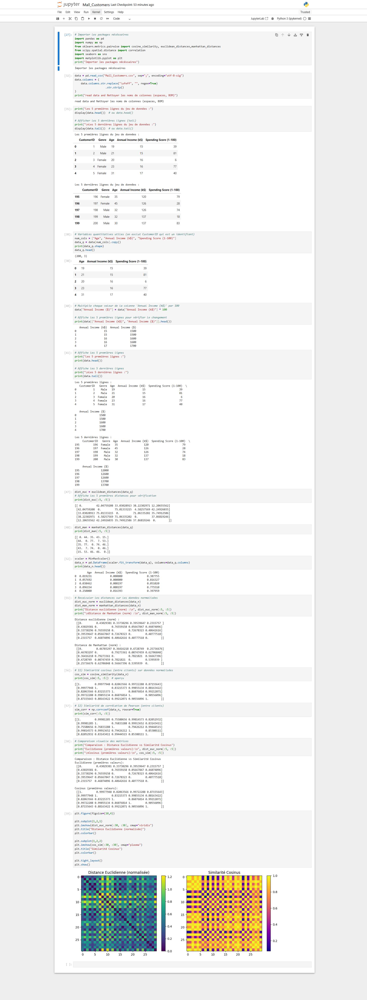

# Data Analysis Project - Customer & Sales Analytics

## 📋 Project Overview

This project performs comprehensive data analysis on customer and sales data, including data manipulation, statistical analysis, and correlation visualization using Python and popular data science libraries.

## 🛠️ Technologies Used

- **Python 3.x**
- **pandas** - Data manipulation and analysis
- **numpy** - Numerical computing
- **matplotlib** - Data visualization
- **seaborn** - Statistical data visualization

## 📦 Installation

```bash
# Install required libraries
pip install pandas numpy matplotlib seaborn
```

## 🔍 Project Structure

The analysis includes the following key operations:

### 1. Data Loading & Exploration
- Import and examine customer data
- Display basic dataset information
- Check data structure and types

### 2. Data Manipulation
- **Sorting**: Sort data by multiple columns (Age, Annual Income, Spending Score)
- **Filtering**: Extract specific customer segments
- **Grouping**: Aggregate data by gender and spending patterns
- **Calculations**: Compute average income and spending by demographics

### 3. Statistical Analysis
- Group-wise statistics (mean, sum, count)
- Cross-tabulation analysis
- Data aggregation by multiple dimensions

### 4. Data Visualization
Two correlation heatmaps are generated:
- **Spearman Correlation Matrix**: Non-parametric correlation analysis
- **Similarity/Distance Matrix**: Customer similarity analysis

## 📊 Key Results

### Final Visualizations

The project produces two key heatmaps:

#### 1. Spearman Correlation Heatmap (left)
- Shows correlation between customer features
- Color-coded from blue (negative) to green (positive correlation)
- Helps identify relationships between age, income, and spending

#### 2. Similarity/Distance Heatmap (right)
- Displays customer similarity patterns
- Warmer colors (yellow/orange) indicate higher similarity
- Cooler colors (purple) indicate lower similarity
- Useful for customer segmentation


*Two heatmaps showing correlation and similarity matrices*

### Key Insights
- Customer segmentation based on spending behavior
- Gender-based spending patterns
- Age and income correlation analysis
- Customer similarity clustering

## 🚀 Usage

1. Clone or download the repository
2. Ensure you have the required CSV data file
3. Open the Jupyter notebook
4. Run all cells sequentially
5. View generated statistics and visualizations

```python
# Basic execution flow
import pandas as pd
import numpy as np
import matplotlib.pyplot as plt
import seaborn as sns

# Load data
data = pd.read_csv('your_data.csv')

# Perform analysis (see notebook for details)
# Generate visualizations
```

## 📈 Analysis Features

- ✅ Data cleaning and preprocessing
- ✅ Descriptive statistics
- ✅ Group-by operations
- ✅ Sorting and filtering
- ✅ Correlation analysis
- ✅ Heatmap visualizations
- ✅ Customer segmentation insights

## 👥 Author

Data Analysis TP - LAMBARAA Abdellah

## 📝 License

This project is part of academic coursework.

---

**Note**: Make sure your data file is in the correct format and path before running the analysis.
